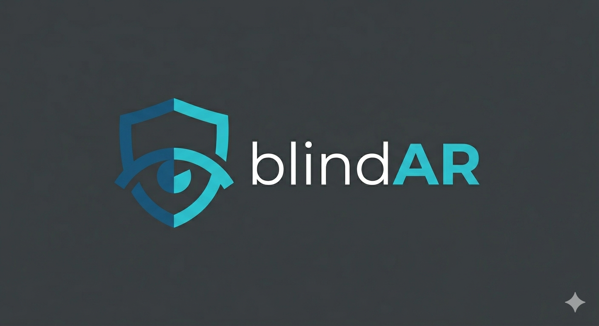

<div align="center">



<br><br>

**Gateway de segurança inteligente para acesso a IA via dispositivos vestíveis**

Grand Prix SENAI de Inovação 2026 — Desafio Petrobras · Cibersegurança e Ética Digital

**Equipe FIREWALL**

<br>

[▶ Ver Solução Completa](https://pedrodiniz310.github.io/blindAR/) · [▶ Testar Protótipo](https://pedrodiniz310.github.io/blindAR/prototipo/prototipo.html)

</div>

---

## 🎯 O Desafio

> *"Como garantir o uso seguro de Inteligência Artificial em óculos de Realidade Aumentada — protegendo autenticação, dados em trânsito e prevenindo vazamento visual — inclusive em redes de terceiros?"*

Colaboradores da Petrobras em campo (plataformas offshore, refinarias, áreas remotas) precisam acessar sistemas de IA com as mãos livres, usando óculos AR. Mas esses dispositivos introduzem riscos que soluções tradicionais de segurança não cobrem: autenticação sem teclado, dados exibidos em superficies visíveis, redes não controladas.

---

## 💡 A Solução

O **BlindAR** é um middleware de segurança que se posiciona entre o dispositivo vestível (HoloLens 2 ou smartphone) e os sistemas de IA corporativos. Ele garante que o acesso é seguro **por padrão** — sem fricção para o técnico, com visibilidade total para o time de segurança.

### Os 4 Pilares

| Pilar | Descrição |
|-------|-----------|
| 🔐 **Identidade Contínua** | Autenticação facial via câmera frontal. Se o dispositivo sair do rosto, a sessão trava em < 1 segundo. Sem senha, sem PIN. |
| 🔒 **Canal Blindado** | Túnel WireGuard criptografado em qualquer rede — Wi-Fi público, satélite, 5G de terceiro. Zero exposição. |
| 🛡️ **Proteção Inteligente** | 5 níveis contextuais: a IA adapta automaticamente o que mostra com base na localização, rede e ambiente. Não bloqueia — **transforma**. |
| 📊 **Governança Total** | Auditoria completa via Microsoft Sentinel. Dashboard em tempo real. Conformidade LGPD nativa. |

### Os 5 Níveis de Segurança

| Nível | Contexto | Comportamento da IA |
|-------|----------|---------------------|
| 🟢 1 | Sala segura, rede interna, biometria OK | Dados completos, sem filtro |
| 🔵 2 | Área de trabalho, rede interna | Dados com watermark dinâmico |
| 🟡 3 | Campo, rede de terceiro | Dados genéricos (sem valores exatos) |
| 🟠 4 | Área pública / observador detectado | Apenas alertas e instruções gerais |
| 🔴 5 | Auth falha / dispositivo removido | Tela bloqueada + alerta ao SOC |

---

## 📂 Estrutura do Repositório

```
blindAR/
├── index.html                      # Landing page da solução (GitHub Pages)
├── prototipo/
│   └── prototipo.html              # Protótipo interativo (webcam + IA)
├── backend/
│   ├── main.py                     # API FastAPI (proxy Supabase)
│   ├── requirements.txt            # Dependências Python
│   ├── supabase_schema.sql         # Schema do banco de dados
│   ├── .env.example                # Template de variáveis de ambiente
│   └── README.md                   # Instruções do backend
├── docs/
│   ├── 01_LEAN_Canvas.txt          # LEAN Canvas (Entregável 1)
│   ├── 02_Arquitetura_Tecnica.txt  # Arquitetura end-to-end detalhada
│   ├── 03_Roteiro_Prototipo.txt    # Roteiro do vídeo protótipo (2 min)
│   ├── 04_Script_Pitch_3min.txt    # Script de apresentação (3 min)
│   ├── 05_Storyboard_Videos.txt    # Storyboard dos 2 vídeos
│   └── 06_Design_Thinking.txt      # Design Thinking completo
├── images/                         # Logos e assets visuais
└── .gitignore
```

---

## 🚀 Como Executar

### Protótipo (Frontend)

Não precisa instalar nada — funciona 100% no navegador.

```bash
# Opção 1: Abrir diretamente
# Abra prototipo/prototipo.html no Chrome ou Edge

# Opção 2: Acessar online
# https://pedrodiniz310.github.io/blindAR/prototipo/prototipo.html
```

**Requisitos:** Chrome ou Edge com suporte a WebRTC (webcam).

### Backend (FastAPI + Supabase)

```bash
# 1. Entrar na pasta do backend
cd backend

# 2. Instalar dependências
pip install -r requirements.txt

# 3. Configurar variáveis de ambiente
# Copiar .env.example para .env e preencher com suas credenciais Supabase
cp .env.example .env

# 4. Iniciar o servidor
python -m uvicorn main:app --reload
```

O servidor inicia em `http://localhost:8000`. Documentação interativa da API em `/docs`.

---

## 🛠️ Stack Tecnológico

| Camada | Tecnologia |
|--------|-----------|
| Dispositivo AR | Microsoft HoloLens 2 (simulado com webcam) |
| Autenticação | Azure AD + Windows Hello + Conditional Access |
| Detecção facial | face-api.js (TensorFlow.js) — processamento local |
| VPN / Túnel | WireGuard |
| Gateway | Azure App Service (FastAPI) |
| IA / LLM | Azure OpenAI (GPT-4o) · Groq (Llama 3.3 70B) |
| Classificação de dados | Microsoft Purview (DLP) |
| SIEM / Monitoramento | Microsoft Sentinel |
| Banco de dados | Supabase (PostgreSQL) |
| MDM | Microsoft Intune |
| Frontend | HTML5 + CSS3 + JavaScript (vanilla) |
| Dashboard | Chart.js |

> **100% das tecnologias são soluções de mercado já disponíveis** — a arquitetura é totalmente testável e implantável.

---

## 📖 Documentação

| Documento | Conteúdo |
|-----------|----------|
| [01 — LEAN Canvas](docs/01_LEAN_Canvas.txt) | Modelo de negócio: problema, solução, métricas, custos e receita |
| [02 — Arquitetura Técnica](docs/02_Arquitetura_Tecnica.txt) | Arquitetura end-to-end com fluxos, componentes e stack completa |
| [03 — Roteiro do Protótipo](docs/03_Roteiro_Prototipo.txt) | Funcionalidades do protótipo e fluxo de demonstração (2 min) |
| [04 — Script do Pitch](docs/04_Script_Pitch_3min.txt) | Roteiro completo da apresentação de 3 minutos |
| [05 — Storyboard](docs/05_Storyboard_Videos.txt) | Storyboard visual dos 2 vídeos (protótipo + pitch) |
| [06 — Design Thinking](docs/06_Design_Thinking.txt) | Empatia, definição, ideação, prototipação e testes |

---

## 🔒 Conformidade LGPD

- Consentimento explícito no primeiro uso, revogável a qualquer momento
- Biometria processada **localmente** no dispositivo (TPM) — imagem facial nunca sai do device
- Direito ao esquecimento implementado com certificado de exclusão
- Todos os acessos auditáveis via Microsoft Sentinel
- Proteção proporcional ao risco (5 níveis contextuais)

---

## 👥 Equipe FIREWALL

| Membro | Área | Função |
|--------|------|--------|
| **Pedro Arthur** | Informática | Porta-voz · Desenvolvimento · Protótipo |
| **Yury** | PCP | LEAN Canvas · Planejamento · Cronograma |
| **Gabriela** | Elétrica | Hardware · Arquitetura física · Testes |
| **Thauane** | Automação | Fluxos de segurança · Design Thinking · Documentação |

---

<div align="center">

**Grand Prix SENAI de Inovação 2026 — Desafio Petrobras**

*A IA não bloqueia. Ela transforma.*

</div>

